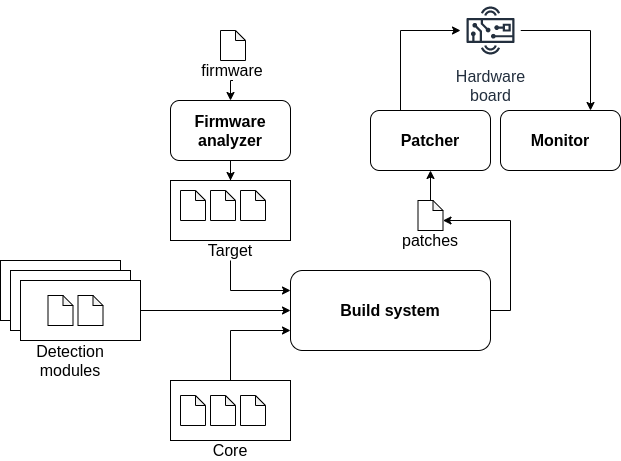
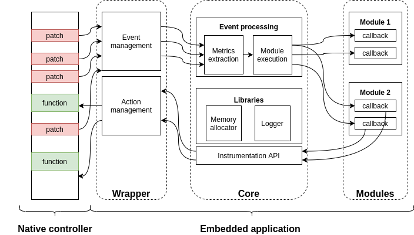

# Architecture overview

## Framework

The framework is composed of four main components:

* **Firmware Analyzer**: this component allows to automatically generate the target files from a firmware,
* **Build System**: this component allows to build the embedded software and generate the list of patches to inject in the controller memory,
* **Patcher**: this component allows to inject into the controller memory the list of patches previously generated,
* **Monitor**: this component allows to interact with the target to monitor the logs and provides debugging capabilities.



## Embedded Software
This toolchain allows to generate a lightweight and modular embedded software, interacting with the firmware to instrument the controller, detect specific events or extract low level characteristics. This embedded software is generated by combining three main parts:

* **Target:** set of configuration, source code and linker files describing how to instrument the targeted controller. *This is the only part which is target specific.*
* **Core:** set of libraries and main application. It triggers specific actions when an event occured, extract low level characteristics, and forward the events to the modules. *This component is target-independent.*
* **Modules:** set of configuration and source code files, implementing the embedded instrumentation modules in a generic way.  *This component is target-independent.*




The *Target* is the only component which is target-dependent: it includes a wrapper allowing to instrument the controller easily, by exposing a simple low level API allowing to detect specific events or access metrics. This wrapper is used by the *Core* component, which is in charge of extracting and inferring low level characteristics when a specific event occurs. Then, it will forward the execution flow to the selected *Modules*, which can execute a specific action when an event occurs, access low level characteristics using a standardized API and trigger actions on the target controller.

## File Tree

Oasis uses the following file tree:
```
├─ docs : this documentation source code
├─ maps : latest embedded softwares
├─ scripts : python scripts and library implementing the framework
├─ modules : directory containing embedded modules
  ├─ module1
    ├─ module.c : module source code
    ├─ module.conf : module configuration file
  ├─ ...
├─ include : Core header files
├─ src : Core source files
├─ targets
  ├─ target1
    ├─ firmware.bin : targeted controller firmware
    ├─ functions.ld : memory mapping of used functions in controller firmare
    ├─ linker.ld : linker configuration file
    ├─ patch.conf : list of patches needed to instrument the controller firmware
    ├─ target.conf : target configuration file
    ├─ wrapper.c  : wrapper source code
  ├─ ...
├─ oasis.conf : oasis configuration file
├─ oasis : utility tool
├─ Makefile : Makefile used to build the embedded software
├─ LICENSE
├─ README.md
```

## Typical workflow

A typical workflow when using Oasis would be:

* Generate a target using the *Firmware Analyzer* if your target is not already present in the *targets* directory (optional)
* Write a new module implementing your instrumentation code (or use one of the existing one)
* Build the embedded software using the *Build System*
* Inject the embedded software using the *Patcher*
* Interact with the embedded software using the *Monitor*
